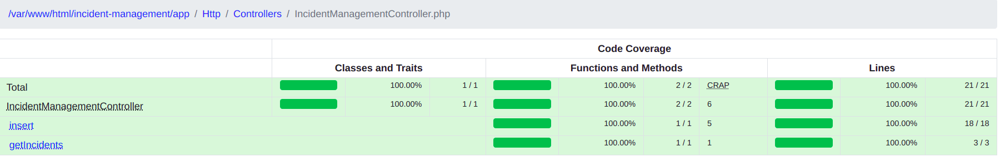

## Incident Management

Steps to run the Project

1) Create new .env file with same content as .env.example
2) update DB details in .env with your creds  
3) composer install
4) php artisan migrate
5) php artisan db:seed --class=IncidentManagementTableSeeder
6) php artisan cache:clear  
7) php artisan serve

### API Details

GET API
http://127.0.0.1:8000/api/incidents

Response

{"no_of_incidents":2,"data":[{"id":1,"latitude":"3.3364240","longitude":"36.8014320","title":"Non consequuntur modi
accusantium molestiae.","category":2,"people":"Accusantium nihil cum sed dolorem. Impedit amet odio rerum. Magni natus
reprehenderit vitae itaque et autem eligendi tempora. Qui minus veritatis ut et est.","comments":"Odio aspernatur
laborum id dolorum quo laborum incidunt. Ut magni ut fugiat quo. Non eligendi neque suscipit est saepe odio libero.","
incidentDate":"2020-09-08 18:48:43","createDate":"1977-03-19 17:45:56","modifyDate":"2010-06-20 01:14:54"},{"id":29,"
latitude":"12.9231501","longitude":"-174.7818517","title":"incident title","category":3,"
people":[{"name":"Name of person","type":"staff"},{"name":"Name of person","type":"witness"},{"name":"Name of person","type":"staff"}]
,"comments":"This is a string of comments","incidentDate":"2020-09-01 23:26:00","createDate":"2020-09-01 13:32:59","
modifyDate":"2020-09-01 13:32:59"}]}

POST API
http://127.0.0.1:8000/api/incidents

body: {
"data": [
{
"id": 0,
"location": {
"latitude": 12.9231501,
"longitude": -174.7818517 },
"title": "incident title",
"category": 3,
"people": [
{
"name": "Name of person",
"type": "staff"
}, {
"name": "Name of person",
"type": "witness"
}, {
"name": "Name of person",
"type": "staff"
}
],
"comments": "This is a string of comments",
"incidentDate": "2020-09-01T23:26:00+00:00",
"createDate": "2020-09-01T13:32:59+01:00",
"modifyDate": "2020-09-01T13:32:59+01:00"
}
]
}

Response

{
"status": true,
"message": "Incidents stored successfully."
}

Execute Test cases

With Text

vendor/bin/phpunit --coverage-text

With HTML

./vendor/bin/phpunit --coverage-html tests/coverage

The above command will create a tests/coverage directory which will have a index.html to show the code which has been
coverd

Image with total code coverage

